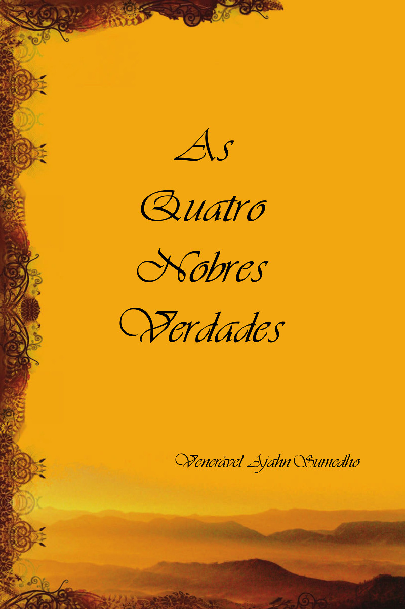

= Quatro Nobres Verdades
:booktitle: {doctitle}
:author: Ajahn Sumedho
:creator: {author}
:version: v1.0
:revdate: 2018-11-27
:doctype: book
:lang: pt
:pubs-logo: sumedharama-logo-only-w100.png
:publisher-name: Publicações Sumedhārāma
:publisher-link-name: www.sumedharama.pt
:publisher-link-url: https://sumedharama.pt/
:source: https://forestsangha.org
:keywords: Ajahn Sumedho, Dhamma, Buddhism, RELIGION / Buddhism / Theravada
:copyright: CC-BY-NC-ND 4.0
:isbn: 978-989-8691-80-4
:identifier: isbn:{isbn}
:imagesdir: assets/photos/92dpi-ebook-sRGB
:includes: manuscript/asciidoc
:front-cover-image: 
:toc: left
:toc-title: Índice
:toclevels: 0

include::{includes}/titlepage.adoc[]

include::{includes}/folhas-quote.adoc[]

include::{includes}/nota-do-tradutor.adoc[]

include::{includes}/preface.adoc[]

include::{includes}/introduction.adoc[]

include::{includes}/01-primeira.adoc[]

include::{includes}/02-segunda.adoc[]

include::{includes}/03-terceira.adoc[]

include::{includes}/04-quarta.adoc[]

include::{includes}/sobre-o-autor.adoc[]

include::{includes}/copyright.adoc[]

